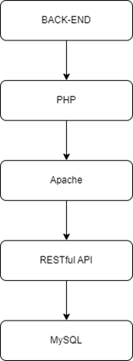
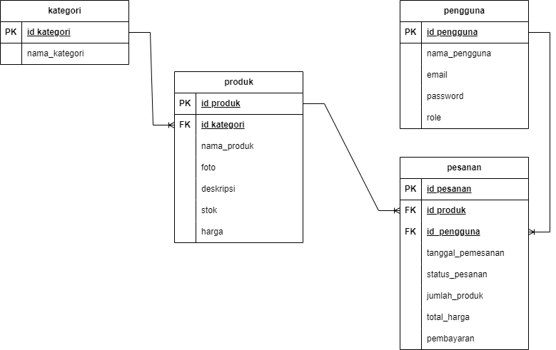

# Proyek Akhir: Sistem Backend Website Fashion Shop


## Fitur Sistem Backend Berbasis Web Online Fashion Shop

### - Manajemen User
Sistem ini akan menyimpan informasi pengguna, termasuk peran mereka sebagai 'owner' atau 'admin', dengan kedua peran tersebut memiliki hak akses penuh untuk melihat, menambahkan, mengubah, dan menghapus informasi pengguna dalam sistem.

- GET /api/user: Membaca semua data user yang ada pada database
- POST /api/user: Menambahkan data user yang baru 
- PUT /api/user: Memperbarui data user
- DELETE /api/user: Menghapus data user yang sudah tidak aktif lagi

### - Manajemen Product
Sistem akan menyimpan informasi detail produk sepatu (nama, deskripsi, harga, gambar, stok, kategori) yang dapat dikelola oleh pemilik dan admin. Pengunjung website dapat melihat daftar produk di halaman utama, menjelajahi produk berdasarkan kategori, dan mengakses halaman detail produk dengan informasi lengkap. Fitur ini memungkinkan manajemen produk yang efisien serta pengalaman belanja yang informatif bagi pengunjung.

- GET /api/product: Membaca semua data product yang ada pada database
- POST /api/product: Menambahkan data product baru 
- PUT /api/product: Memperbarui data product
- DELETE /api/product: Menghapus data product yang sudah tidak aktif lagi

### - Manajemen Category
Sistem ini akan menyimpan informasi mengenai berbagai kategori fashion yang tersedia, seperti sepatu, pakaian pria, pakaian wanita, aksesoris, dan kategori lainnya. Dengan pemilik dan admin memiliki kemampuan penuh untuk menambahkan kategori baru, mengubah nama kategori yang ada, memperbaruinya atau menghapus kategori yang sudah tidak diperlukan lagi.

- GET /api/category: Membaca semua data category yang ada pada database
- POST /api/category: Menambahkan data category yang baru 
- PUT /api/category: Memperbarui data category
- DELETE /api/category: Menghapus data category yang sudah tidak aktif lagi

### - Manajemen Order
Sistem akan mencatat detail pesanan pelanggan, termasuk informasi produk, pelanggan, dan status pesanan. Pemilik dan admin dapat mengelola pesanan melalui panel admin, memperbarui status, dan melihat riwayat transaksi. Pengunjung dapat mengakses informasi kontak toko untuk pemesanan offline. Fitur pembaruan status pesanan memungkinkan pelacakan real-time dari 'pending' hingga 'selesai', meningkatkan transparansi bagi pelanggan.

- GET /api/order: Membaca semua data order yang ada pada database
- POST /api/order: Menambahkan data order yang baru 
- PUT /api/order: Memperbarui data order
- DELETE /api/order: Menghapus data order yang sudah tidak aktif lagi

## Skema Tech Stack


- **Backend**: Bagian dari aplikasi web toko baju yang menangani logika bisnis, operasi data, dan komunikasi dengan basis data.
- **PHP**: Bahasa pemrograman untuk membangun backend aplikasi web, termasuk RESTful API untuk pengelolaan produk, kategori, users, dan pesanan.
- **Apache**: Server web open-source untuk menghosting aplikasi web berbasis PHP.
- **RESTful API**: Dibangun menggunakan PHP untuk menyediakan antarmuka pemrograman aplikasi yang memungkinkan pertukaran data dalam format JSON atau XML.
- **MySQL**: Sistem manajemen basis data relasional (RDBMS) open-source untuk menyimpan dan mengelola data aplikasi web toko baju online.

## ERD

## Struktur Database

Berikut penjelasan dari masing-masing tabel dan relasinya:

1. **Tabel kategori:**
   - Memiliki primary key (PK) id_kategori
   - Berisi informasi nama_kategori
   - Terhubung ke tabel produk melalui id_kategori

2. **Tabel produk:**
   - Memiliki PK id_produk
   - Memiliki foreign key (FK) id_kategori yang terhubung ke tabel kategori
   - Berisi informasi tentang produk seperti nama_produk, foto, deskripsi, stok, dan harga
   - Terhubung ke tabel pesanan melalui id_produk

3. **Tabel pengguna:**
   - Memiliki PK id_pengguna
   - Berisi informasi pengguna seperti nama_pengguna, email, password, dan role
   - Terhubung ke tabel pesanan melalui id_pengguna

4. **Tabel pesanan:**
   - Memiliki PK id_pesanan
   - Memiliki FK id_produk yang terhubung ke tabel produk
   - Memiliki FK id_pengguna yang terhubung ke tabel pengguna
   - Berisi informasi pesanan seperti tanggal_pemesanan, status_pesanan, jumlah_produk, total_harga, dan pembayaran

Skema ini menggambarkan sistem di mana:
- Produk dikategorikan
- Pengguna dapat membuat pesanan
- Setiap pesanan terkait dengan satu produk dan satu pengguna
- Informasi detail tentang produk, pengguna, dan pesanan disimpan dalam tabel masing-masing

Struktur ini memungkinkan untuk melacak inventaris produk, mengelola pengguna, dan mencatat pesanan dalam sistem.

## Struktur Proyek
```
UAS-BACKEND-FASHION-SHOP/
├── config/
│   ├── database.php
│   └── table.php
├── controllers/
│   ├── CategoryController.php
│   ├── OrderController.php
│   ├── ProductController.php
│   └── UsersController.php
├── middleware/
│   └── Router.php
├── models/
│   ├── CategoryModel.php
│   ├── OrderModel.php
│   ├── ProductModel.php
│   └── UsersModel.php
├── services/
│   ├── CategoryService.php
│   ├── OrderService.php
│   ├── ProductService.php
│   └── UsersService.php
├── .env
├── .htaccess
├── app.php
├── db_fashion_shop.sql
└── README.md

```
Berikut adalah deskripsi singkat dari setiap file dan direktori:

1. **.env**: Berisi konfigurasi lingkungan seperti detail koneksi database untuk fashion shop.

2. **db_fashion_shop.sql**: File SQL yang berisi skrip untuk membuat database dan tabel yang diperlukan untuk toko fashion.

3. **.htaccess**: Mengatur URL rewrite untuk mengarahkan semua permintaan ke app.php.

4. **app.php**: File utama untuk mengatur rute dan menghubungkan dengan controller yang sesuai dalam aplikasi fashion shop.

5. **config/**:
   - database.php: Kelas Database untuk mengatur koneksi ke database fashion shop menggunakan PDO.
   - table.php: Mengandung array yang memetakan nama tabel di database fashion shop.

6. **controllers/**:
   - CategoryController.php: Mengatur operasi CRUD untuk kategori produk fashion.
   - ProductController.php: Mengatur operasi CRUD untuk produk fashion.
   - OrderController.php: Mengatur operasi CRD untuk pesanan fashion.
   - UsersController.php: Mengatur operasi terkait pengguna toko fashion.

7. **middleware/**:
   - Router.php: Kelas Router untuk mengatur rute dan menghubungkan dengan action yang sesuai dalam aplikasi fashion shop.

8. **models/**:
   - CategoryModel.php: Model untuk operasi database terkait kategori produk fashion.
   - ProductModel.php: Model untuk operasi database terkait produk fashion.
   - OrderModel.php: Model untuk operasi database terkait pesanan fashion.
   - UsersModel.php: Model untuk operasi database terkait pengguna toko fashion.

9. **services/**:
   - CategoryService.php: Layanan untuk operasi logika bisnis terkait kategori produk fashion.
   - ProductService.php: Layanan untuk operasi logika bisnis terkait produk fashion.
   - OrderService.php: Layanan untuk operasi logika bisnis terkait pesanan fashion.
   - UsersService.php: Layanan untuk operasi logika bisnis terkait pengguna toko fashion.
